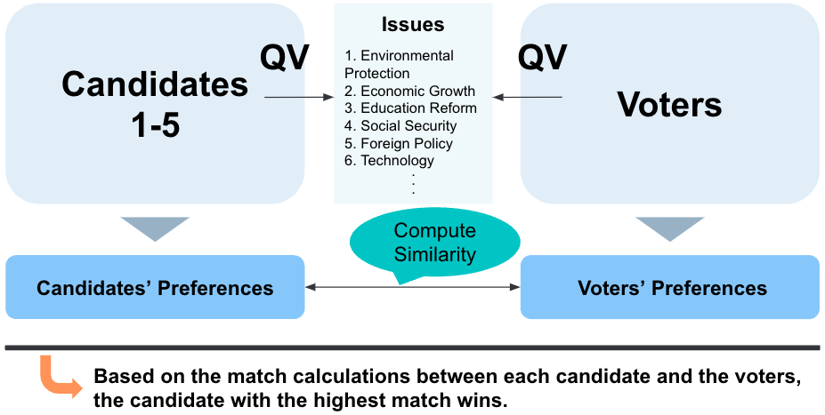

# Bidirectional Quadratic Voting Leveraging Issue-Based Matching

Presentation at [ETHTokyo 2024](https://ethtokyo.com/) - see [presentation.pdf](presentation.pdf) for details.

For the simulation results, please refer to the Jupyter notebook file [simulation.ipynb](simulation.ipynb).

# Author

Kentaro Kuribayashi &lt;kentarok@gmail.com&gt;
