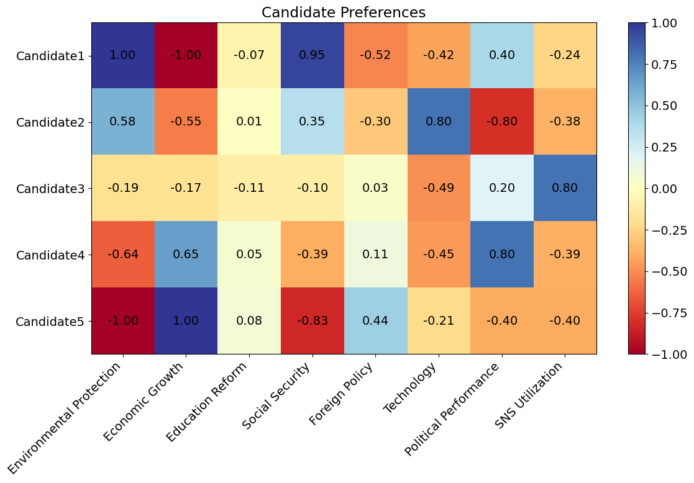

# Bidirectional Quadratic Voting
## Leveraging Issue-Based Matching

Kentaro Kuribayashi
GMO Pepabo, Inc.

ETHTokyo 2024

---

# About Me

- Kentaro Kuribayashi
- CTO at GMO Pepabo, Inc.
- [kentarokuribayashi.com](https://kentarokuribayashi.com)

---

# Disclaimer

This presentation does not represent the views of my affiliated organization, nor does it reflect my personal political opinions.

---

# Challenge: The Voting Dilemma (1/2)

Balancing experience with innovation in candidate selection. 

---

# Challenge: The Voting Dilemma (2/2)

- Focusing on past achievements might hinder recognition of new ideas
- Prioritizing the latter may inadvertently favor opposing candidates in reality

---

# Potential Solution: Quadratic Voting (QV)

- QV as a potential solution
- Allows voters to express distributed preferences
- Not limited to choosing a single candidate

---

# Applying QV to Elections

---

# Taking It a Step Further

- QV in elections still leaves voters uncertain about candidates' true preferences
- Need for a voting method aligning voters and candidates on specific issues

---

# Proposed Solution: Bidirectional Quadratic Voting (BQV)

---

# Simulation Setup

 

---

# Candidate Preferences

- Candidates span political spectrum
- Candidate 2: tech expert

---

# Voter Distribution

- Four voter distributions assumed: normal, bimodal, left-skewed, and right-skewed
- Simulations conducted for each distribution

---

# Simulation Results (*1)

- Balanced results vs. normal voting
- Higher support for tech-expert candidate

>>> *1: Only results for normal distribution shown

---

# Conclusion

- QV/BQV is a promising mechanism for social implementation on Ethereum
- GMO aims to collaborate with the Ethereum community to create positive social impact
- Together, we can leverage blockchain technology to build a better world
