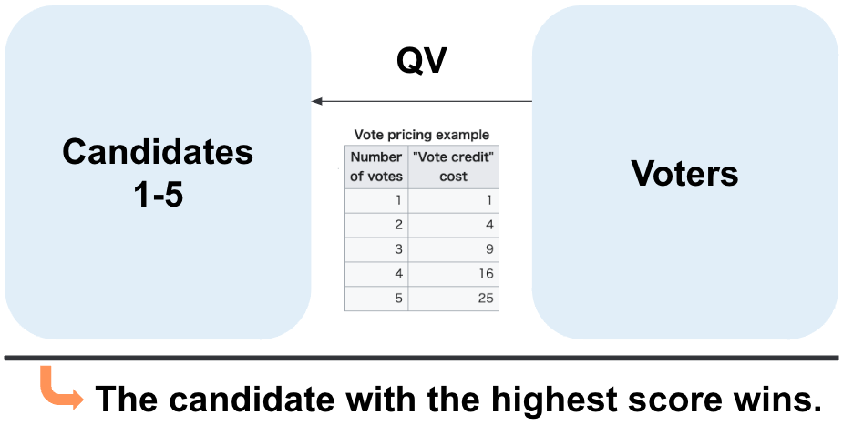
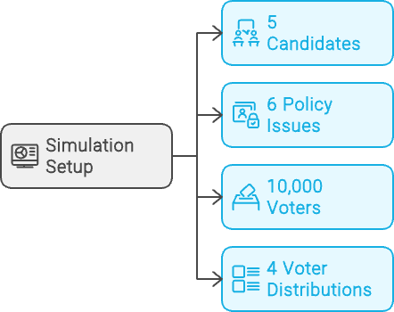

# Bidirectional Quadratic Voting
## A Proposal for Precise Candidate Matching

Kentaro Kuribayashi
GMO Pepabo, Inc.

ETHTokyo 2024

---

# About Me

- Kentaro Kuribayashi
- CTO at GMO Pepabo, Inc.
- [kentarokuribayashi.com](https://kentarokuribayashi.com)

---

# Challenge: The Voting Dilemma

---

# Potential Solution: Quadratic Voting (QV)

- Express varying preference strengths
- Quadratic credit allocation
- Amplifies minority opinions

---

# Applying QV to Elections

---

# Improving on QV: Policy-Based Matching

---

# Proposed Solution: Bidirectional Quadratic Voting (BQV)

---

# Simulation Setup

 

---

# Simulation Results

- Comparison of normal voting, QV, and bidirectional QV
- Verification across various voter distribution patterns

---

# Key Findings

1. Bidirectional QV shows more balanced results across different voter distributions
2. QV and Bidirectional QV give more weight to minority opinions compared to normal voting
3. The impact of voting method varies depending on the voter ideology distribution

---

# Conclusion

- Bidirectional QV more accurately reflects complex preferences
- Supports major candidates without compromising technology-focused opinions
- Suitable voting system for societies with diverse policy preferences

---

# Future Challenges

- Implementation and verification in actual elections
- Voter education and development of user-friendly interfaces
- Consideration of legal and ethical aspects
- Further refinement of the simulation model
